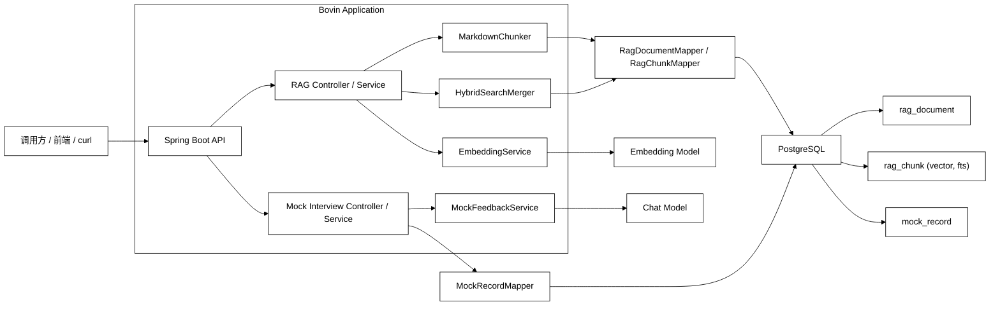
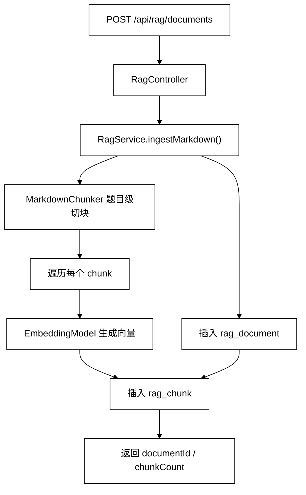
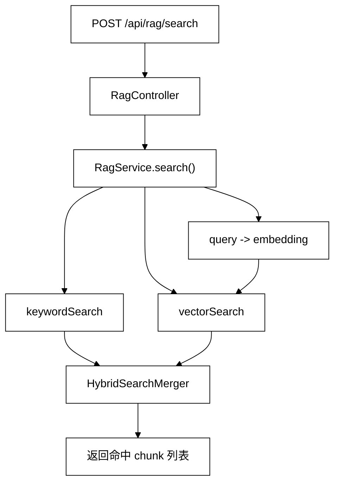
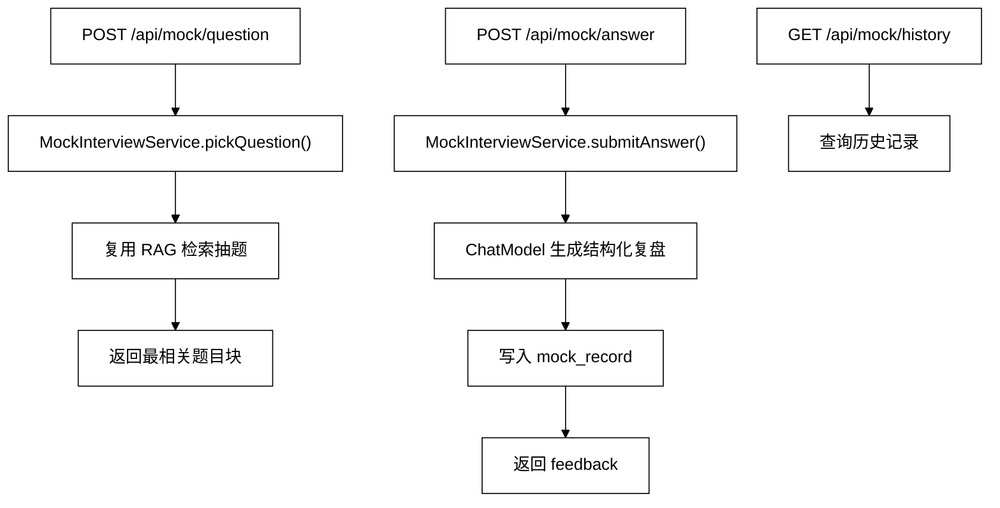

# Bovin

> 基于 `Spring Boot + PostgreSQL + pgvector + Spring AI` 的面试知识库与模拟面试系统，支持面经导入、题目级切块、向量化检索、混合召回，以及 AI 复盘闭环。

## 项目定位

Bovin 主要解决两个问题：

1. 将零散的面经、题库、项目问答等非结构化资料沉淀为可检索的知识库。
2. 在知识库基础上实现“抽题 -> 作答 -> 复盘 -> 历史回看”的最小模拟面试闭环。

这个项目的重点不在于单纯调用模型，而在于把文档结构化、检索、存储、反馈整合成一个完整的后端工程链路。

## 项目能做什么

- 支持将 Markdown 面经导入知识库
- 支持题目级切块，避免标题、元信息和题目正文混在一起
- 支持文本向量化并写入 `PostgreSQL + pgvector`
- 支持关键词检索与向量检索的混合召回
- 支持模拟面试抽题、提交回答、AI 复盘、历史记录查看

## 核心技术栈

- `Spring Boot 4.0.6`
- `Spring AI 2.0.0-M8`
- `PostgreSQL`
- `pgvector`
- `MyBatis-Plus`
- `OpenAI Compatible API`
- `JUnit + MockMvc`

## 系统架构图

## 核心数据流

### 1. 导入链路

### 2. 检索链路

### 3. 模拟面试链路

## 核心存储设计

### `rag_document`

用于保存原始文档主记录。

- `title`
- `source_name`
- `corpus_type`
- `document_type`
- `raw_markdown`

### `rag_chunk`

用于保存切块后的检索单元，是 RAG 的核心表。

- `document_id`
- `chunk_index`
- `heading`
- `chunk_text`
- `fts_text`
- `embedding VECTOR(1536)`

### `mock_record`

用于保存模拟面试答题记录与 AI 复盘结果。

- `chunk_id`
- `document_id`
- `source_name`
- `question_text`
- `answer_text`
- `feedback_json`

## 关键接口

### RAG 接口

- `POST /api/rag/documents`
  - 导入 Markdown 文档并完成切块、向量化、入库
- `POST /api/rag/search`
  - 基于关键词检索与向量检索返回命中片段

### 模拟面试接口

- `POST /api/mock/question`
  - 从 interview 语料中抽取最相关问题
- `POST /api/mock/answer`
  - 提交回答并生成结构化 AI 复盘
- `GET /api/mock/history`
  - 查询历史练习记录

## 关键设计决策

### 为什么使用 PostgreSQL + pgvector

- 项目同时存在结构化数据和向量数据，使用同一个数据库可以降低系统复杂度。
- `pgvector` 可以直接在 PostgreSQL 中完成向量存储、距离计算和索引管理。
- 对当前项目的 MVP 和中小规模语料场景来说，维护成本低于独立向量数据库方案。

### 为什么做题目级切块

- 面经天然是“题目 / 追问 / 要点”的结构。
- 如果使用通用段落切块，容易把标题、元信息和题目正文混在一起，导致召回噪声高。
- 题目级切块更适合模拟面试与问答检索场景。

### 为什么使用 Hybrid Retrieval

- 纯关键词检索容易漏掉语义相近但表达不同的内容。
- 纯向量检索可能把语义扩散过头，导致命中过泛。
- 因此项目采用“关键词检索 + 向量检索 + 融合排序”的方式，提高召回稳定性。

### 为什么模拟面试模块先做 MVP

- 首版目标不是做复杂的多轮 Agent，而是验证完整业务闭环是否成立。
- 因此优先实现“抽题、作答、保存记录、AI 复盘”四个核心动作，避免过早引入 session、追问链和复杂状态管理。

## 工程能力体现

从工程实现角度，这个项目主要体现了以下能力：

- 能将非结构化文本转化为可检索、可训练的数据模型
- 能独立完成 `PostgreSQL + pgvector + 模型 API` 的集成联调
- 能围绕业务场景优化切块策略，而不是只依赖默认框架能力
- 能将检索能力进一步封装成可用的业务接口，而不是停留在底层 demo
- 能通过 `Controller / Service / Mapper / Entity / DTO` 分层实现清晰的后端结构
- 能补充接口级测试，验证导入、检索、抽题、答题、历史记录等主链路

## 已实现能力边界

当前版本已经具备：

- RAG 文档导入
- Markdown 题目级切块
- 向量化入库
- 混合检索
- 模拟面试抽题
- AI 复盘
- 历史记录回看

## 后续可优化方向

后续可以继续沿以下方向演进：

- 增加 `rerank` 提升前排结果质量
- 在 `/mock/answer` 中改为服务端按 `chunkId` 回查题目元信息
- 增加标准答案库与多轮追问能力
- 支持文件级批量导入
- 补充更多异常路径与回归测试

## 面试时可以这样介绍

> 这是一个基于 RAG 的面试知识库与模拟面试系统。项目支持把面经资料按题目级切块后进行向量化入库，并结合 PostgreSQL 全文检索和 pgvector 相似度检索实现混合召回；在此基础上，我又实现了抽题、作答、记录保存与 AI 复盘接口，形成了完整的训练闭环。这个项目里我重点处理了切块策略、向量存储、混合检索、模型接入和接口测试这些问题。
