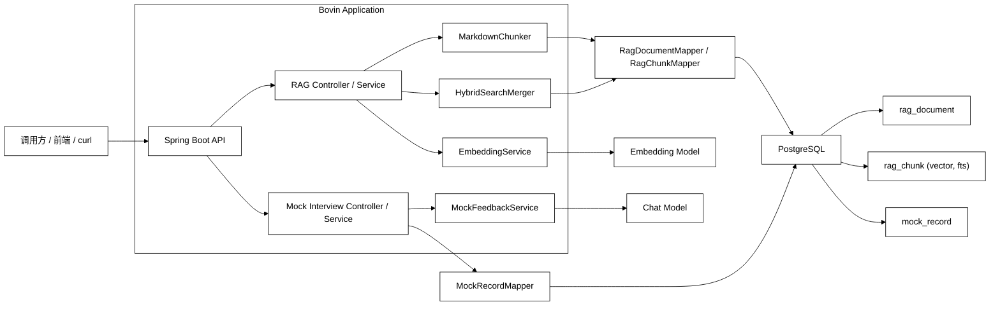
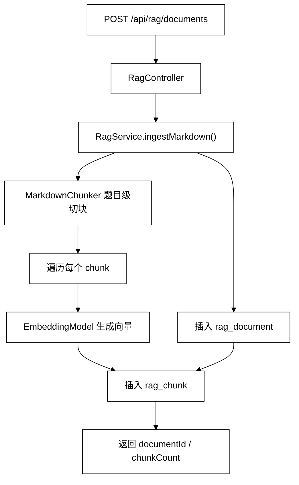
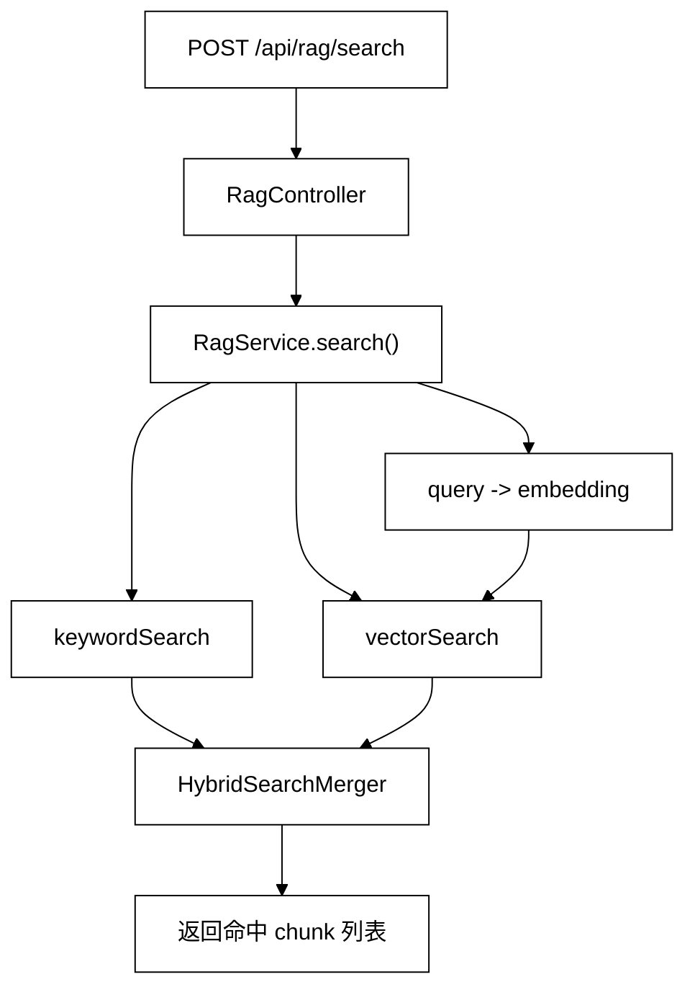
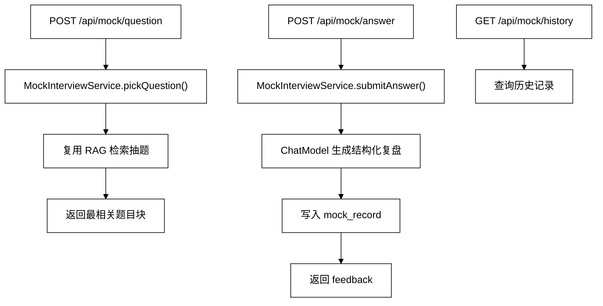

# Bovin

> 基于 `Spring Boot + PostgreSQL + pgvector + Spring AI` 的面试知识库与模拟面试系统，支持面经导入、题目级切块、向量化检索、混合召回，以及 AI 复盘闭环。

## 项目定位

Bovin 主要解决两个问题：

1. 将零散的面经、题库、项目问答等非结构化资料沉淀为可检索的知识库。
2. 在知识库基础上实现“抽题 -> 作答 -> 复盘 -> 历史回看”的最小模拟面试闭环。

这个项目的重点不在于单纯调用模型，而在于把文档结构化、检索、存储、反馈整合成一个完整的后端工程链路。

## 项目能做什么

- 支持将 Markdown 面经导入知识库
- 支持题目级切块，避免标题、元信息和题目正文混在一起
- 支持文本向量化并写入 `PostgreSQL + pgvector`
- 支持关键词检索与向量检索的混合召回
- 支持模拟面试抽题、提交回答、AI 复盘、历史记录查看

## 核心技术栈

- `Spring Boot 4.0.6`
- `Spring AI 2.0.0-M8`
- `PostgreSQL`
- `pgvector`
- `MyBatis-Plus`
- `OpenAI Compatible API`
- `JUnit + MockMvc`

## 系统架构图

## 核心数据流

### 1. 导入链路

### 2. 检索链路

### 3. 模拟面试链路

## 核心存储设计

### `rag_document`

用于保存原始文档主记录。

- `title`
- `source_name`
- `corpus_type`
- `document_type`
- `raw_markdown`

### `rag_chunk`

用于保存切块后的检索单元，是 RAG 的核心表。

- `document_id`
- `chunk_index`
- `heading`
- `chunk_text`
- `fts_text`
- `embedding VECTOR(1536)`

### `mock_record`

用于保存模拟面试答题记录与 AI 复盘结果。

- `chunk_id`
- `document_id`
- `source_name`
- `question_text`
- `answer_text`
- `feedback_json`

## 关键接口

### RAG 接口

- `POST /api/rag/documents`
  - 导入 Markdown 文档并完成切块、向量化、入库
- `POST /api/rag/search`
  - 基于关键词检索与向量检索返回命中片段
